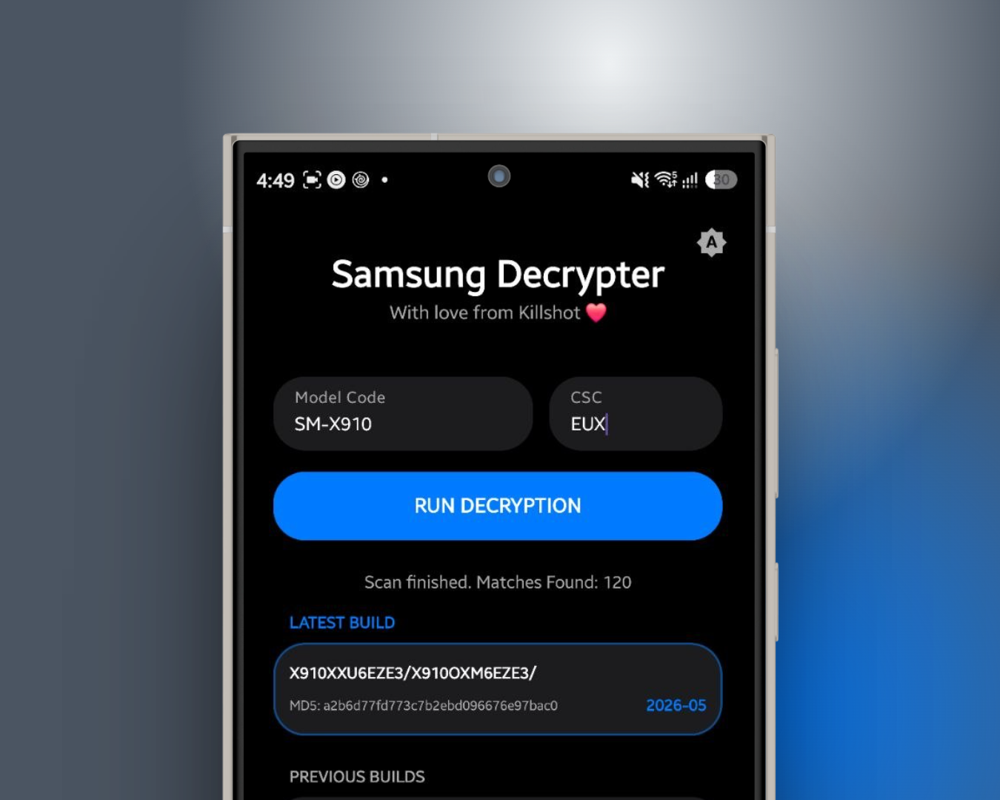

# Samsung Decrypter 🛡️

  

A modern, native Android tool for fetching and decrypting official Samsung firmware triplets. Built with Jetpack Compose and designed with a clean, OneUI-inspired aesthetic.

## Features
- **Dual-Hash Cryptography (HMAC-SHA256 & MD5):** Full SHA256 and MD5 Decryption
- **Streamlined Workflow:** Simple input for Model Code and CSC.
- **Real-time Status:** Visual feedback during the decryption process.
- **Build History:** Keep track of your previous firmware fetches.
- **Native Experience:** Dark/Light mode support with a native UI feel.

## Getting Started
1. **Download:** Grab the latest `.apk` from the [Releases](https://github.com/fahadalijaved/SamsungDecrypter/releases) section.
2. **Install:** Sideload the APK on your Android device (ensure "Install from unknown sources" is enabled).
3. **Usage:** Enter your device's model code (e.g., `SM-S931U1`) and CSC region (e.g., `EUX`), then tap **Run Decryption**.

## Built With
- **Kotlin & Jetpack Compose:** For a fluid, responsive UI.
- **Material3:** Following modern Android design guidelines.

## Credits
- **Killshot**
- **Wr3ckl3ss**
- **Vikram**

---
*Disclaimer: Use at your own risk. This tool is for educational purposes only.*
